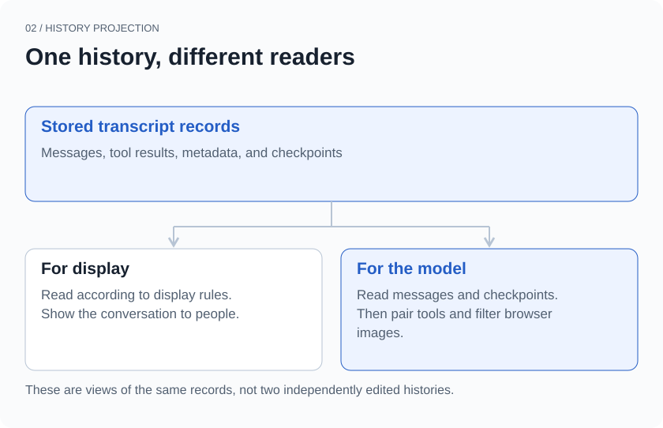
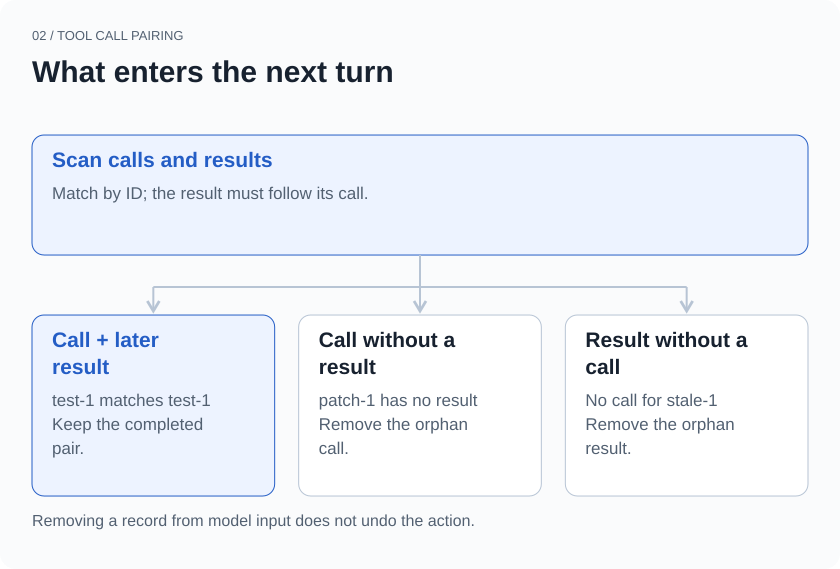
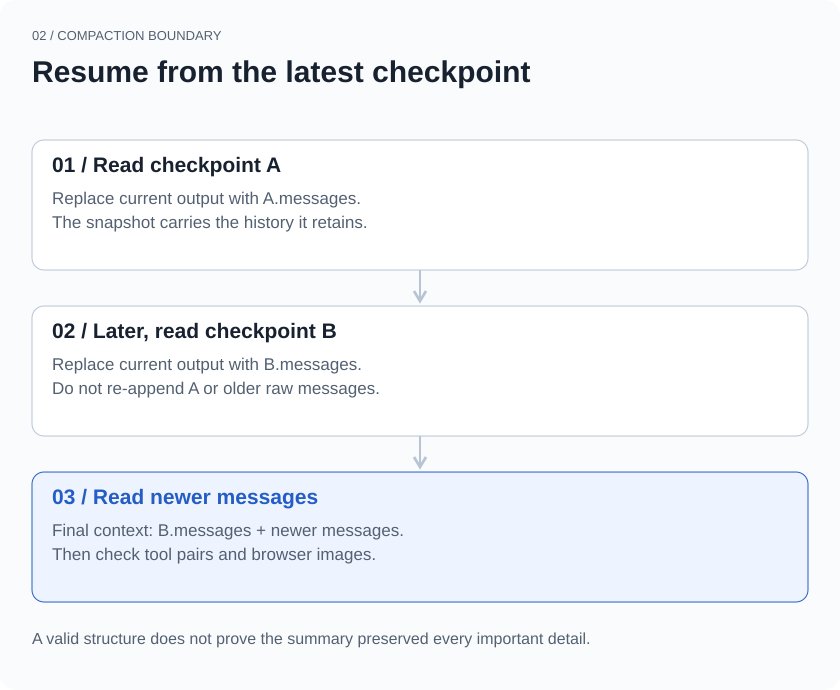

## An interrupted tool call

You ask an agent to inspect a project. It runs the tests, then prepares to edit a file. The tests return a failure. Just after the editing tool is called, you press Stop.

The next day, you reopen the conversation. All the earlier messages are there. You say, “Continue.”

For a person, the situation is straightforward: the tests failed, and the edit was interrupted. For the model API receiving the next request, the history may contain an incomplete structure—a tool call with no corresponding result. Copying the visible conversation into a request does not necessarily produce valid model input.

Long-running agents encounter this problem in several ways. Interruption is one. History trimming, context compaction, and differences in tool responses can also change the relationships between messages. Saving messages answers whether they can be found again. The next question is how they should be read.

xopc puts an explicit conversion step between these two jobs: `buildSessionContextForLlm`. This article follows three decisions in that conversion: which records enter the model context, how tool calls remain paired with results, and where context resumes after compaction.

> The opening task is a constructed example. This article covers the preparation of stored records for model input. An interrupted tool may already have performed its action. Repairing context is not a recovery mechanism for external operations.

## One history, different ways to read it

An agent’s transcript contains more than what the user and assistant said. Model changes, message labels, local shell executions, extension state, and compaction checkpoints can all be stored with the conversation.

These records serve different purposes. Labels help people navigate history. A model-change record helps with debugging. A local command’s output may be useful in the next turn. If every record is turned into an ordinary chat message, the model has to read irrelevant information and may lose track of who said what.

xopc therefore handles stored records, display messages, and model messages separately. Here, “model context” means the portion derived from conversation history. It does not include other inputs such as the system prompt and tool definitions.



*Figure 1 · Different readers apply different rules to the same records. The arrows represent reading and transformation, not two independently edited copies of the conversation.*

For example, a `kind: context` record does not enter the model as a chat message. Model changes, labels, and extension state do not acquire a conversational role merely because they were saved. Local shell executions follow another rule: included executions become text containing the command, exit code, and output. Executions marked for exclusion are skipped.

One detail matters here: **hidden in the interface does not mean excluded from model input.** For ordinary extension messages, `display: false` affects the display function. The model path has its own conversion rules. Treating UI visibility as a context switch would introduce a subtle error.

This separation requires more code. Each new record type needs a decision about storage, display, and model input. The benefit is that those decisions have an explicit home rather than being scattered across clients.

## Pair calls with their results

Return to the interrupted task. To focus on the structure, simplify the records to four entries:

```text
assistant  Run tests       call_id = test-1
assistant  Edit file       call_id = patch-1
tool       Tests failed    call_id = test-1
context    Turn stopped
```

`test-1` has both a call and a later result. `patch-1` has only a call. The stop record is useful for investigation, but it cannot stand in for the editing tool’s result.

xopc’s `sanitizeToolPairs` first scans the messages and records where calls and results occur. An ID enters the set of retained pairs only if a matching result exists after its call. The function then builds the filtered message list.

It does not simply delete an entire assistant message. One message may contain text and several tool calls. Unpaired call blocks are removed, while ordinary text and paired calls remain. The message is removed only if no usable content remains. Conversely, an orphan result with no corresponding call is excluded.



*Figure 2 · This is the pairing check in the history projection. Excluding an entry from model input neither deletes its stored record nor reverses a tool action that has already happened.*

Why not fill in the missing result with “The edit failed”?

A missing result establishes that the record is incomplete. It does not establish that the action failed. The tool may not have started, or it may have finished changing the file without reporting back. Inventing success or failure would turn a structural repair into a fabricated fact. This layer instead leaves the unpaired call out of the next request.

That choice has a cost: the model may no longer see an attempted action whose result is missing. If the next step depends on whether it happened, the runtime or a later tool must inspect the actual state. Restoring a usable message structure does not establish that the task is safe to retry.

This is also only a basic check. Duplicate call IDs, malformed arguments, and the requirements of different model APIs need further handling. xopc has separate code for provider-aware transcript preparation. Finding a pair here is not a complete validation of every provider’s protocol.

## How many old screenshots should stay?

Browser tasks create another kind of repetition. The agent opens a page, expands a menu, and fills a form. Each observation may include a screenshot. By the fifth step, the first four images no longer show the current page, yet they still occupy context.

Keeping every image makes visual changes available for comparison, but the images keep accumulating. Removing all of them loses the current layout, controls, and state. In this history-conversion path, xopc takes a middle course: **keep images from the most recent browser tool result that contains them, and retain text observations from earlier browser results.**

The implementation finds calls named `browser_use`, then associates their results by call ID. Image blocks in earlier results are replaced with an omission notice. Their semantic observation text remains. This rule does not delete every user-uploaded image, nor does it enforce one image across the entire conversation. The most recent browser result can itself contain several image blocks.

This is useful when deciding what to click next. The latest image supplies current visual state, while earlier text preserves what was observed along the way. If the task is specifically to compare two screenshots, however, removing an older image loses relevant information. The needed images must be obtained separately. This is a default trade-off for sequential browser interaction, not a universal design for visual tasks.

The choice does not require rewriting the original history. The function produces a model-facing view. Letting the next turn see fewer images is different from making those images unavailable to the user.

## Where to resume after compaction

As history grows, filtering metadata and old screenshots is no longer enough. Compaction creates a new starting point: it summarizes older material while retaining messages needed to continue.

The complication is that conversation continues after compaction, and another compaction may happen later. If loading the session repeatedly combines the original history, the old summary, and the new summary, content is duplicated and the context budget fills up again.

xopc’s compaction record contains a `messages` snapshot, along with a summary, source sequence information, the retained-message boundary, token counts before and after compaction, and audit information. While rebuilding model context, a structurally valid compaction record replaces the messages accumulated so far with its own `messages`. Reading then continues through the records after it.



*Figure 3 · A later valid compaction boundary replaces the earlier context starting point. Its snapshot already contains the history it needs to retain; older raw messages are not appended again.*

The reading process can be expressed in a few lines of pseudocode:

```text
Read records in order:
  Usable ordinary message → append
  Valid compaction checkpoint → replace current output with its messages
Continue reading records after the checkpoint
Finally, pair tools and filter browser images
```

The name “compaction summary” alone does not determine the behavior. A `compactionSummary` record used for display or audit does not automatically become model context here. The complete `type: compaction` record changes the starting point. Saving a piece of text called a summary is not the same as saving a recoverable checkpoint.

This keeps the reading rule consistent across repeated compactions. It does not solve every problem with summaries. A summary can omit a critical constraint, and a structurally valid checkpoint can still be incomplete in meaning. Source and audit information help with investigation. We still need to check whether the resulting context preserves what the task requires.

## How we check these rules

“Continue chatting for two turns and see if it looks fine” is a weak test for these problems. A fluent answer may simply have avoided using the missing information. We inspect the conversion output itself.

| Constructed history | Expected result |
| --- | --- |
| A context record follows an ordinary message | The context record does not appear in model messages |
| One assistant message contains paired and orphan calls | Retain the pair and ordinary text; remove the orphan call |
| A tool result has no earlier matching call | Exclude the result from model input |
| Two browser observations contain images | Keep earlier text, omit older images, and retain images from the newest result |
| New messages follow a compaction checkpoint | Use the checkpoint snapshot, then append the new messages |
| The history contains two compactions | Use the later checkpoint as the new starting point |

The session-context tests linked below contain checks for these cases. They validate deterministic conversion rules, not the model’s understanding of the task or the reliability of tool execution.

The first article explained why a fact’s presence in long-term memory does not mean it should affect an answer now. Conversation history has a similar boundary: **a saved record is not necessarily ready to enter the next request unchanged.**

When history is still present but the agent cannot continue properly, we inspect the stored records, the generated model messages, and the tools’ actual state separately. Looking at all three helps distinguish lost information, broken message structure, and an action that happened without reporting back. The next article follows that last problem: when a user approves an external action, what has to happen before we can call it complete?

## Implementation and tests

Reviewed against the public code snapshot on September 21, 2026. This article focuses on the projection of conversation history, not the compaction planner or every provider-specific adaptation.

- [History conversion, tool pairing, and browser-image rules](https://github.com/xopcai/xopc/blob/a2a1fb40af4dc42fc35416ded195b573ab5b8977/src/session/session-context-for-llm.ts)
- [Tests for these conversion rules](https://github.com/xopcai/xopc/blob/a2a1fb40af4dc42fc35416ded195b573ab5b8977/src/session/__tests__/session-context-for-llm.test.ts)
- [Provider-aware transcript preparation](https://github.com/xopcai/xopc/blob/a2a1fb40af4dc42fc35416ded195b573ab5b8977/src/agent/transcript/transcript-hygiene.ts)
- [Choosing model-facing transcript policies](https://github.com/xopcai/xopc/blob/a2a1fb40af4dc42fc35416ded195b573ab5b8977/src/agent/transcript/transcript-policy.ts)

[Previous: When you change your mind: how a personal agent updates its memory](/en/blog/when-memory-changes)

[Next: What does clicking “Allow” actually authorize?](/en/blog/what-an-approval-allows)
