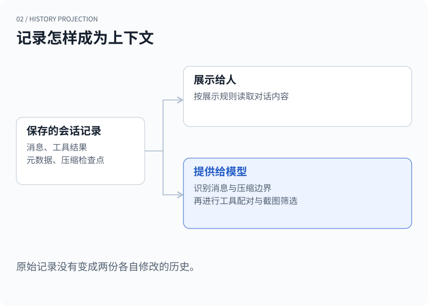
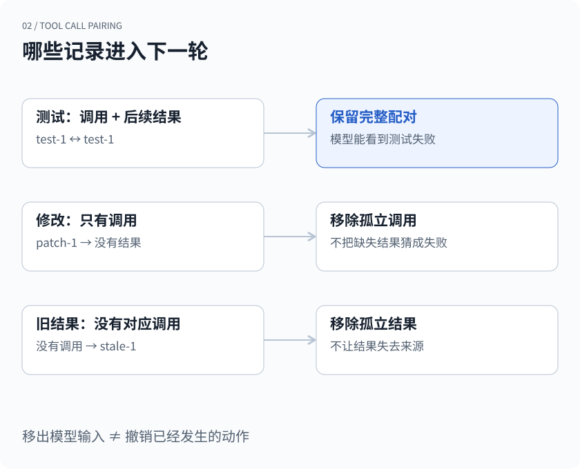
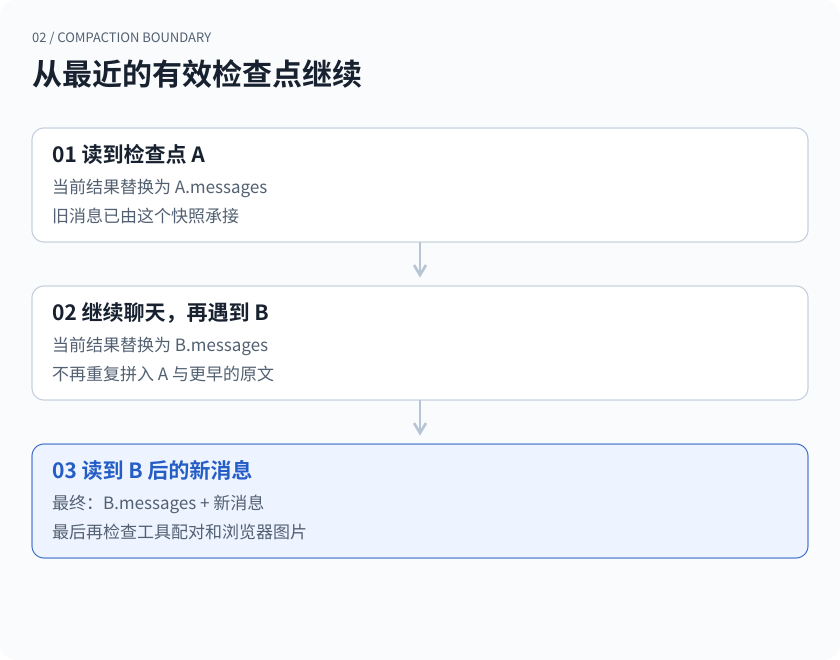

## 一次被打断的工具调用

你让 Agent 检查一个项目。它先运行测试，再准备修改文件。测试已经返回失败结果，修改工具刚被调用，你按下了停止。

第二天打开会话，前面的消息都在。你说：“继续。”

对人来说，这段对话没有什么难懂的：测试失败了，修改还没完成。但对接收请求的模型接口来说，历史里可能留下了一个不完整的结构——有工具调用，没有对应结果。把屏幕上的记录照搬过去，并不一定能组成下一次合法的模型请求。

这个问题在长时间运行的 Agent 里很常见。中断只是其中一种来源；历史裁剪、上下文压缩，以及不同工具的返回方式，都可能改变消息之间的关系。保存消息解决了“还能不能找到”，接着还要回答“下一轮该怎样读”。

xopc 在这两件事之间放了一层明确的转换：`buildSessionContextForLlm`。本文沿着这层转换看三个决定：哪些记录应该进入模型、工具调用怎样成对保留，以及历史压缩后从哪里接上。

> 开头的任务是构造示例。下文讨论的是已保存记录进入模型前的整理规则，不代表被中断的工具一定没有执行，也不把上下文修复当作外部操作的恢复机制。

## 同一段历史，有不同的读法

一段 Agent 会话记录的东西，比用户和助理说过的话多。模型切换、消息标签、本地命令执行、扩展状态、压缩检查点，都可能跟着会话保存下来。

这些记录各有用途。消息标签方便人回看；一次模型切换方便排查问题；本地命令的输出可能有助于下一轮判断。如果所有记录都被拼成普通聊天消息，模型既要读无关信息，也容易混淆是谁说了什么。

因此，xopc 分开处理用于保存的记录、展示给人的消息，以及送给模型的消息。这里的“模型上下文”特指从会话历史得到的这一部分，不包括系统提示词、工具定义等其他输入。



*图 1 · 同一份记录有不同的读取规则。箭头表示读取和转换，不表示维护两份各自修改的聊天历史。*

例如，`kind: context` 的记录不会作为聊天消息进入模型。模型切换、标签和扩展状态等元数据，也不会仅仅因为被保存下来就获得一个对话角色。本地命令则有另一条规则：允许进入上下文的执行记录，会被整理成包含命令、退出码和输出的文本；被标记为排除的执行记录会跳过。

有个细节值得单独拿出来：**不在界面显示，不等于不进入模型。** 普通扩展消息的 `display: false` 会影响展示函数，但模型侧有自己的转换规则。把 UI 的可见性直接当成上下文开关，会留下很难察觉的错误。

这种区分增加了代码量。每新增一种记录，都需要想清楚它怎样保存、怎样显示、怎样进入模型。好处是这些决定终于有了明确位置，不必散落在各个客户端里。

## 先把调用与结果配起来

回到开头的例子。为了说清结构，先把记录简化为四项：

```text
assistant  运行测试       call_id = test-1
assistant  修改文件       call_id = patch-1
tool       测试失败       call_id = test-1
context    本轮已被停止
```

`test-1` 有调用，也有后面的结果。`patch-1` 只有调用。停止记录有排查价值，却不能充当修改工具的返回结果。

xopc 的 `sanitizeToolPairs` 会先扫描消息，分别记录调用和结果的位置。一个 ID 只有在找到对应结果、并且结果位于调用之后时，才进入可以保留的集合。随后再生成整理后的消息列表。

这不是简单地删掉整条 assistant 消息。一条消息里可以同时有文字和多个工具调用：未配对的调用块会被过滤，其他文字和已配对的调用仍然可以留下。如果过滤后没有任何有效内容，这条消息才会被去掉。反过来，找不到调用的孤立结果也不会保留。



*图 2 · 图示针对历史投影中的配对检查。移出模型输入并不意味着删除原始记录，更不意味着撤销已经发生的工具操作。*

这里最容易误解的取舍是：为什么不替缺失的结果补一句“修改失败”？

因为缺少结果只说明记录不完整，不能证明外部动作失败。工具可能还没开始，也可能已经改完文件、只是没来得及回报。随便补一个成功或失败，会把结构修复变成事实编造。这一层选择不把孤立调用带进下一次请求。

代价也很明确：模型可能因此看不到一次尚未配对的尝试。若下一步依赖它是否真正发生，运行时或后续工具需要检查实际状态。上下文能恢复到可用结构，不代表任务已经恢复到可安全重试的状态。

此外，这只是基础检查。调用 ID 重复、参数格式异常、不同模型接口的消息约束，还需要其他处理。xopc 另有按模型策略整理历史的代码；不能把这里的“找到一对”理解成对所有提供方协议的完整验证。

## 旧截图该留下多少

浏览器任务又带来一类更直观的冗余。Agent 打开页面、展开菜单、填写表单，每次观察都可能产生截图。到了第五步，前四张图已经不是当前页面，却仍然占着上下文。

全部保留，能够回看视觉变化，但图片会持续累积。全部丢掉，又会失去当前页面的布局、按钮位置和状态。xopc 在这条历史转换路径里选择了一个折中：**保留最近一条包含图片的浏览器工具结果中的图片，较早的浏览器结果保留文字观察。**

实现先找出名为 `browser_use` 的调用，再通过调用 ID 关联它们的结果。较早结果中的图片块会换成一条说明，语义观察文本继续留下。这条规则不会顺手删除用户上传的所有图片，也不是对整个会话只允许一张图；最新那条浏览器结果本身可能包含多个图片块。

这个选择对“接下来点击什么”比较实用。最新画面提供当前状态，先前的文字记录保留“刚才看到了什么”。但如果任务本身要求比较两张页面截图，旧图被移出这一份上下文就会损失信息，需要另外取回所需图像。它是一种面向连续操作的默认取舍，不能替代所有视觉任务的输入设计。

我们也不需要为了这个取舍修改原始历史。这里生成的是模型侧的读取结果；让下一轮少看一些图，和让用户再也找不到那些图，是两件不同的事。

## 压缩之后，从哪里继续

当历史变长，光过滤元数据和旧截图还不够。上下文压缩会生成一个新的可用起点：概括较早内容，同时保留需要继续使用的消息。

难点在于，压缩发生之后还会继续聊天，后面也可能再压缩一次。如果每次加载时都把原始历史、旧摘要、新摘要重新拼起来，内容就会重复，预算也会很快被吃回去。

xopc 的压缩记录中保存了当时的 `messages` 快照，以及摘要、来源序号、保留位置、压缩前后 token 数和审计信息。重建模型上下文时，一旦遇到符合结构要求的压缩记录，就用其中的 `messages` 替换此前积累的消息，再继续接上它后面的内容。



*图 3 · 后一个有效压缩边界替换前面的上下文起点。图中的快照已包含它应当保留的历史，不会再把前面的原文重复追加一次。*

可以把读取过程写成很短的伪代码：

```text
从前往后读取记录：
  普通的可用消息 → 追加
  有效压缩检查点 → 用检查点内的消息替换当前结果
继续读取检查点之后的记录
最后进行工具配对与浏览器图片筛选
```

“压缩摘要”这个名字还不够判断行为。用于展示或审计的 `compactionSummary` 记录，不会在这里自动变成上下文；真正改变读取起点的是带完整结构的 `type: compaction` 记录。只保存一段叫 summary 的文字，不等于保存了一个可恢复的检查点。

这个做法让多次压缩的读取规则保持一致，却没有解决摘要本身的所有问题。摘要可能漏掉关键约束；检查点结构正确，也不代表内容没有遗漏。来源和审计信息有助于追查，最终仍要检查压缩后的上下文是否保留了任务需要的东西。

## 这些规则如何检查

这类问题不适合只靠“继续聊两轮，看起来没事”来验证。一次流畅回答，可能恰好没有用到丢失的信息。我们更关心转换结果本身。

| 构造的历史 | 应当得到的结果 |
| --- | --- |
| 普通消息后插入 context 记录 | 模型消息中不出现这条记录 |
| 一条 assistant 消息含完整调用和孤立调用 | 完整配对保留，孤立调用移除，普通文字仍在 |
| 一个工具结果找不到之前的调用 | 这个结果不进入模型输入 |
| 两次浏览器观察都有图片 | 早期文字保留，旧图片移除，最新结果的图片保留 |
| 压缩检查点后又出现新消息 | 使用检查点快照，再接新消息 |
| 同一历史出现两次压缩 | 后一个检查点成为新的起点 |

这些用例在文末的会话上下文测试中都有对应检查。它们验证的是确定性的转换规则，不是模型理解任务的质量，也不是工具执行的可靠性。

第一篇谈到，长期记忆里存着一条事实，不等于它现在应该影响回答。会话历史也有类似的边界：**记录已经保存，不等于它适合原样进入下一次请求。**

遇到“历史明明还在，Agent 却接不上”的问题时，我们会分别看保存的记录、生成的模型消息，以及工具的真实状态。把这三处放在一起，才容易分清是信息丢了、结构断了，还是动作发生了却没有回报。下一篇会继续讨论最后一种情况：用户批准了一次外部操作，执行到哪一步才算完成？

## 实现与测试

本文核对于 2026 年 9 月 21 日，链接固定到同一公开代码快照。本文重点是会话历史投影，不覆盖压缩规划器或所有模型提供方的适配细节。

- [历史到模型上下文的转换、调用配对和浏览器图片规则](https://github.com/xopcai/xopc/blob/a2a1fb40af4dc42fc35416ded195b573ab5b8977/src/session/session-context-for-llm.ts)
- [上述转换规则的测试](https://github.com/xopcai/xopc/blob/a2a1fb40af4dc42fc35416ded195b573ab5b8977/src/session/__tests__/session-context-for-llm.test.ts)
- [按模型策略执行的历史整理](https://github.com/xopcai/xopc/blob/a2a1fb40af4dc42fc35416ded195b573ab5b8977/src/agent/transcript/transcript-hygiene.ts)
- [模型侧历史策略的选择](https://github.com/xopcai/xopc/blob/a2a1fb40af4dc42fc35416ded195b573ab5b8977/src/agent/transcript/transcript-policy.ts)

[上一篇：当用户改变主意，个人 Agent 如何更新自己的记忆？](/zh/blog/when-memory-changes)

[下一篇：用户点了“允许”，Agent 究竟获准做什么？](/zh/blog/what-an-approval-allows)
