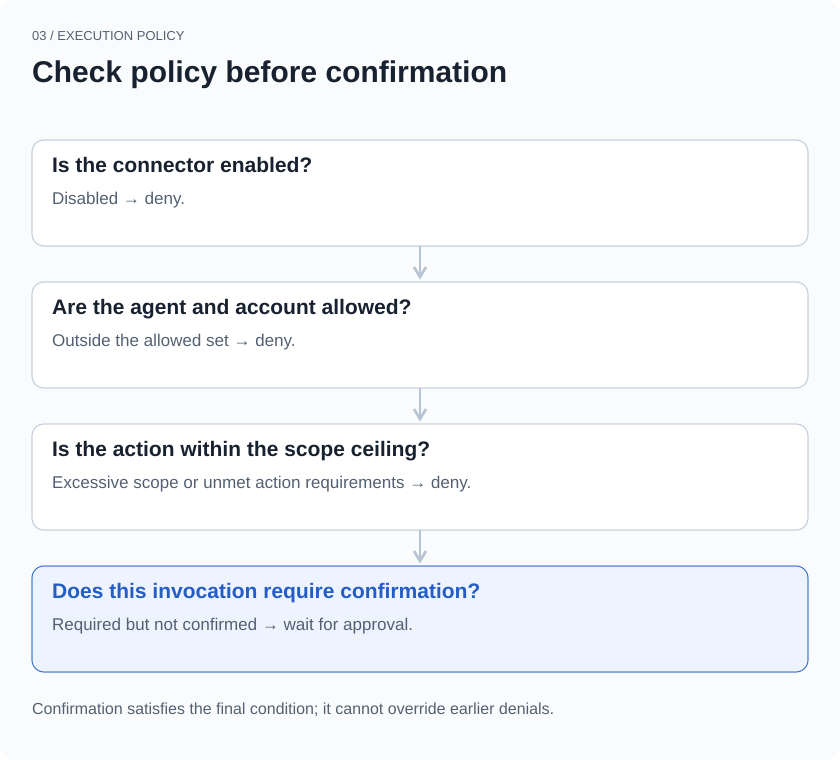
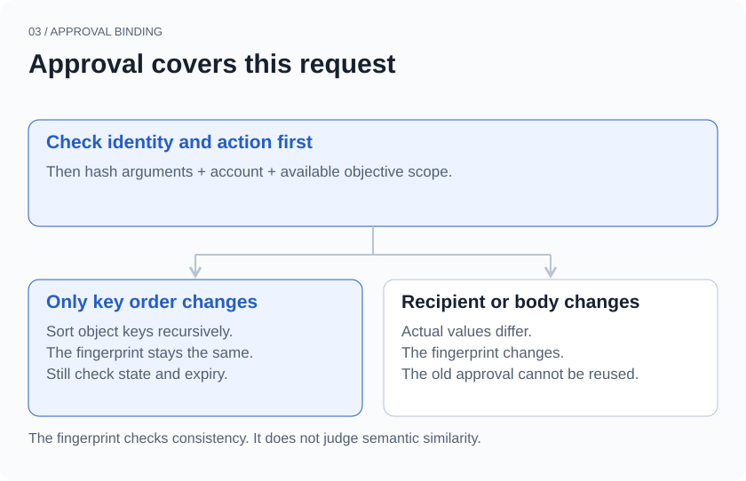
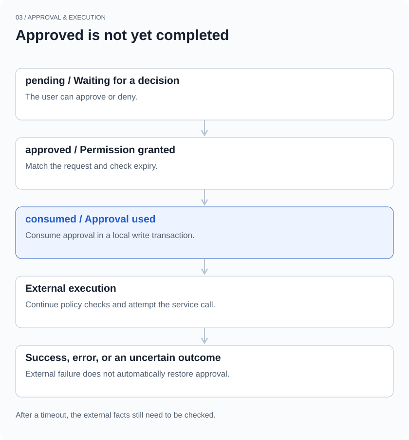

## Start with a changed recipient

You ask an agent to email a progress update to a colleague. It prepares the recipient, subject, and body, then waits for confirmation. You review it and click Allow.

The agent then notices that another person is involved in the project and adds them to CC. It still has the approval you just gave. Is the message it is about to send still the one you approved?

If approval is only a `confirmed = true` flag in the conversation, that question is difficult to answer. The flag says you agreed to something. It does not say which email, which account, or which arguments you agreed to.

xopc’s external-connector path records those conditions separately. This article uses the Composio connector implementation to follow an action through policy checks, an approval request, and approval consumption. Email makes the problem concrete; the example fields are simplified rather than a complete request format for a particular mail API.

> This article describes one connector execution path. Other tools have their own permission mechanisms. These rules should not be assumed to cover every shell command, browser action, or third-party service.

## A connected account does not authorize every action

Connecting an external account establishes which identity the system can use to access a service. Local policy still has to decide which agents can use that account and what they may do with it.

`evaluateConnectorExecutionPolicy` checks whether the connector is enabled, whether the agent is allowed, whether the account is within the allowed set, and whether the action exceeds the permission ceiling. The scopes are `read`, `write`, and `admin`. An action not marked as curated also requires an admin ceiling in this policy layer. That marker is action metadata, not proof that an action is risk-free.

Only after those checks does the policy ask whether this invocation needs confirmation. Configuration can require confirmation for every action, for writes, for admin actions, or not at this step. xopc does not turn every tool call into a confirmation dialog.



*Figure 1 · The order of policy checks. Confirmation satisfies the condition that requires user approval; it cannot enable a disabled connector or make an out-of-scope action permissible.*

Suppose a connector is restricted to reading. A user’s confirmation does not automatically upgrade it to write access. If writes are allowed but require confirmation, the execution path returns `confirmation_required`. The external action has not been called at that point.

The order matters. Asking whether to continue, then treating the answer as permission to bypass every restriction, conflates two questions: whether a capability is available at all, and whether the user agrees to this particular use of it.

## Bind approval to a specific action

When confirmation is required, xopc creates an approval record. It includes the user principal, connector, connection, agent, conversation, action ID, argument fingerprint, and expiry time. In the corresponding waiting workflow, it also links to a wait record.

On the next execution attempt, an `approvalId` alone is insufficient. The executor first checks that the approval belongs to the current user, connector, action, conversation, and agent. It also verifies that the connection associated with the original approval represents the current account. Only then does it check the argument fingerprint and try to consume the approval.

In this path, the fingerprint includes three things: the arguments passed to the action, the account ID, and the current objective scope when available. That scope derives from the current transcript, the objective or input identifier, and objective revision information. It prevents “approved earlier in this conversation” from naturally becoming “approved for everything later in this conversation.”

```text
This approval covers:
  Account      Work mailbox A
  Action       Send email
  Recipient    Colleague A
  Body         The reviewed progress update
  Scope        The current input or waiting objective

On a later call:
  Colleague A → Colleague B   Argument fingerprint changes
  Mailbox A → Mailbox B       Account does not match
  Send email → Delete email  Action does not match
```

Object keys are sorted recursively before serialization and SHA-256 hashing. Reordering JSON object keys therefore does not create a different approval request. Array order and actual value changes still affect the fingerprint.



*Figure 2 · Action, identity, and conversation are checked through separate fields. Arguments, account, and objective scope participate in the fingerprint. The diagram omits specific connection identifiers and parameter structures.*

The hash checks consistency. It does not encrypt the arguments, and it does not decide whether two passages mean roughly the same thing. Even if the agent only wants to improve the wording, an edited body is a changed action. The agent should not decide on the user’s behalf that the difference is too small to matter.

This can lead to another confirmation request. We accept that cost because the boundary around what may change after approval needs to be explicit. If a workflow needs fewer interruptions, it should use a deliberate policy setting rather than quietly expanding one approval into standing authorization.

## A preview for people, a check for code

A user cannot decide whether to send an email by inspecting a hash. The approval record therefore also stores an argument preview.

xopc’s preview function masks fields whose names match patterns such as password, token, and authorization. It also limits string length, array length, and nesting depth. These limits reduce the chance of displaying credentials directly and keep large tool arguments from overwhelming the confirmation area.

The preview and fingerprint serve different purposes. The preview is for comprehension and may omit content. The fingerprint covers the complete action arguments, not just truncated preview text. Otherwise, two bodies with the same beginning and different endings could look identical in the preview and mistakenly be treated as the same approved request.

This distinction also exposes a product limitation: **unchanged parameters do not prove that the user has seen all of them.** Matching field names cannot detect every sensitive item embedded in ordinary text. Truncation can hide something important. A useful confirmation interface for long emails or bulk edits still needs a way to inspect the target and full contents. A fingerprint cannot solve that reading problem.

## From approval to execution

An approval starts as `pending`. The user’s decision can move it to `approved` or `denied`. After its expiry time, the relevant checks can mark it `expired`. Approvals created by this Composio path currently have a ten-minute lifetime.

The executor can change a record to `consumed` only if it is still approved, has not expired, and matches the argument fingerprint. The read and update happen within a SQLite write transaction. A consumed record cannot provide approval again.

Clicking Allow does not itself mean the external service has been called. In workflows linked to a wait record, the resume function also checks that the active wait is still the original one, belongs to the same user and agent, and remains open. The resume request carries the wait ID, transcript ID, and version. An old approval cannot simply wake a different waiting objective.



*Figure 3 · Approval state and execution outcome are separate information. “Consumed” means the approval has been used, not that the external service has completed the action. Denial and expiry paths are simplified.*

One-time consumption has a practical benefit: repeatedly submitting the same approval ID cannot produce unlimited new execution attempts. It also makes error handling important. A caller cannot simply loop on the same request whenever an error occurs.

## Consumed does not mean sent

Now consider the difficult gap in this design.

The executor consumes approval before entering the external execution path, which includes policy checks. Several outcomes are possible: the service returns success; a local or remote error occurs before the action; or the action happens but its response is lost on the network.

In that last case, a timeout does not establish that the email was not sent. A consumed approval does not establish that it was sent, either. `consumed` describes the state of an authorization record.

Could we wait until execution succeeds and only then mark the approval as consumed? That creates a different window. The external service finishes, but the local process crashes before updating the record. After restart, it still sees `approved` and may perform the action again.

A local SQLite transaction controls local state. It cannot include the remote mail service in that same transaction. **One-time approval is not a guarantee of exactly-once external execution.** The approval table alone does not deliver that guarantee in this implementation.

Reducing duplicate actions further depends on the service: does it accept an idempotency key? Can the result be checked using a returned resource ID? Can the caller verify the external state before deciding whether to retry? These are ways to handle uncertain outcomes, not capabilities that this approval mechanism has already implemented uniformly.

Connector execution auditing therefore distinguishes a policy decision from an execution result. Waiting for confirmation or being denied by policy can be recorded as not executed. The external-call path then records success or error, with associated timing information. Investigating a failure requires the approval record, the execution audit, and the external facts. A green “Approved” status is not enough to tell the user, “Your email was sent.”

## The boundaries we check

Deliberately changing the conditions around an approval is more informative than demonstrating one successful send.

| What changes | The boundary to preserve |
| --- | --- |
| Object keys are reordered | The argument fingerprint stays the same |
| Actual arguments change | The original fingerprint cannot authorize the changed request |
| A different agent or account is used | Local policy or approval identity checks reject the request |
| The action needs write access but the ceiling is read | Confirmation cannot bypass the scope ceiling |
| The same approval is used a second time | A consumed record cannot be consumed again |
| Approval has expired | Earlier consent no longer makes the record valid |

Existing unit tests directly cover deterministic hashing, preview redaction, policy denials, and the rule that a wrong fingerprint cannot consume approval while the correct one can do so only once. Expiry, identity, and wait resumption also have explicit execution checks. The presence of those checks should not be presented as exhaustive testing of every race, network failure, or third-party behavior.

The design comes back to a plain question: **is the action the agent is about to take still the one the user approved?**

Account, action, arguments, objective scope, and expiry turn that question into conditions code can check. Whether the external operation succeeded remains a question for execution results and verifiable facts. Being precise about both keeps approval from becoming a reassuring button with an unclear meaning.

## Implementation and tests

Reviewed against the public code snapshot on September 21, 2026. These links cover the local execution and approval path for Composio connectors. This article is not a comprehensive security audit.

- [Connector execution, account selection, and approval binding](https://github.com/xopcai/xopc/blob/a2a1fb40af4dc42fc35416ded195b573ab5b8977/src/agent/external-tools/composio-provider.ts)
- [Local execution policy](https://github.com/xopcai/xopc/blob/a2a1fb40af4dc42fc35416ded195b573ab5b8977/src/connectors/policy.ts)
- [Argument fingerprints and previews](https://github.com/xopcai/xopc/blob/a2a1fb40af4dc42fc35416ded195b573ab5b8977/src/connectors/approval.ts)
- [Approval states and one-time consumption](https://github.com/xopcai/xopc/blob/a2a1fb40af4dc42fc35416ded195b573ab5b8977/src/storage/sqlite/connector-repository.ts)
- [Objective scope and wait records](https://github.com/xopcai/xopc/blob/a2a1fb40af4dc42fc35416ded195b573ab5b8977/src/storage/sqlite/connection-wait-repository.ts)
- [Wait-resumption checks after approval](https://github.com/xopcai/xopc/blob/a2a1fb40af4dc42fc35416ded195b573ab5b8977/src/connectors/approval-resume.ts)
- [External calls and execution auditing](https://github.com/xopcai/xopc/blob/a2a1fb40af4dc42fc35416ded195b573ab5b8977/src/connectors/composio-sessions.ts)
- [Policy tests](https://github.com/xopcai/xopc/blob/a2a1fb40af4dc42fc35416ded195b573ab5b8977/src/connectors/__tests__/policy.test.ts) · [Fingerprint and preview tests](https://github.com/xopcai/xopc/blob/a2a1fb40af4dc42fc35416ded195b573ab5b8977/src/connectors/__tests__/approval.test.ts) · [Approval-consumption tests](https://github.com/xopcai/xopc/blob/a2a1fb40af4dc42fc35416ded195b573ab5b8977/src/connectors/__tests__/connector-repository.test.ts)

[Previous: Why chat history isn’t the same as model context](/en/blog/history-is-not-context)

[Explore xopc’s connectors and collaboration capabilities](/en/product-map)
