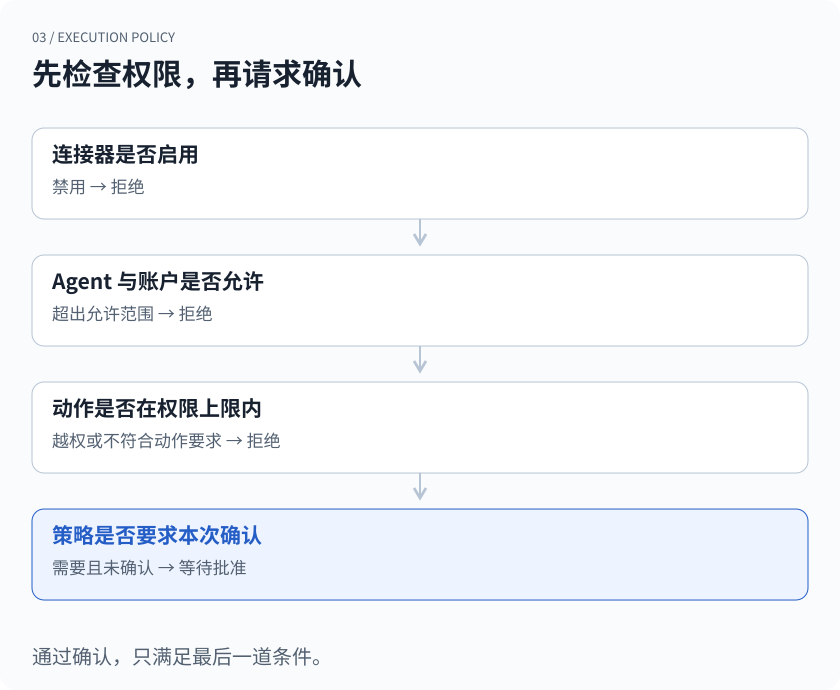
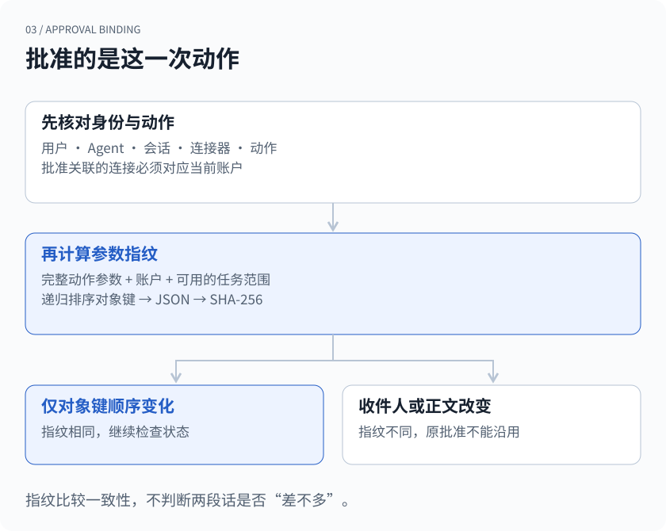
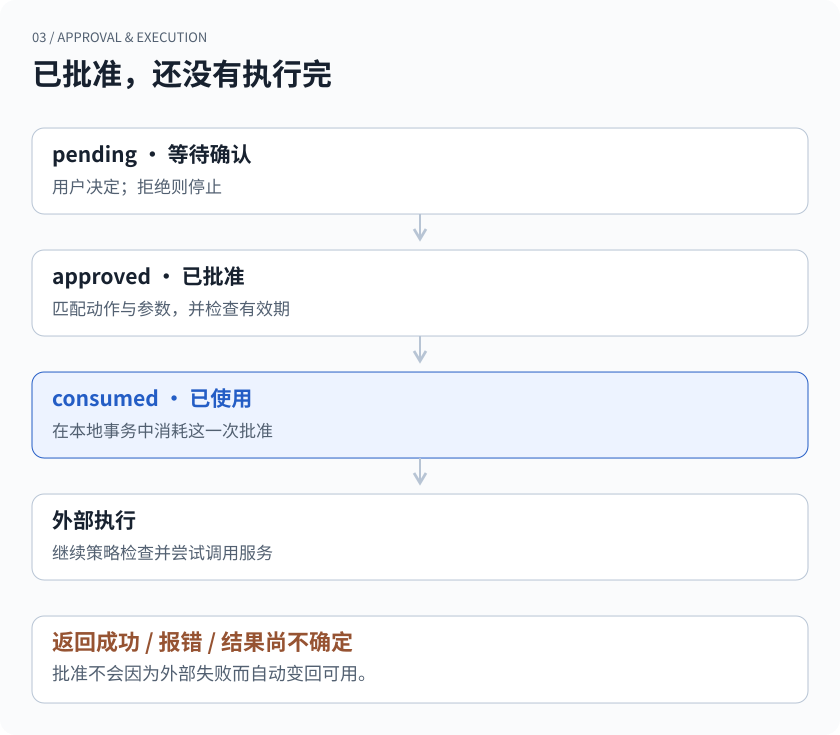

## 先看一封改过收件人的邮件

你让 Agent 给同事发一份进度说明。它准备好了收件人、标题和正文，停下来等你确认。你看完，点了“允许”。

随后，Agent 发现另一个人也在项目里，于是给邮件加了一个抄送地址。它手里仍然有刚才的批准。这次发送，还算你同意的那件事吗？

如果批准只是会话里的一个 `confirmed = true`，系统很难回答。这个标记表达了“用户同意过”，却没有说明同意的是哪封邮件、哪个账户，或者哪一组参数。

xopc 的外部连接器路径会把这些条件单独记下来。下面以 Composio 连接器的执行实现为例，拆开一次动作从策略检查、请求批准，到使用批准的过程。邮件只是为了把问题说具体；文中的字段示例也经过简化，不是某个邮件 API 的完整参数格式。

> 本文描述这条连接器执行路径。不同工具有各自的权限机制，不能把这里的规则推及所有命令、浏览器操作或第三方服务。

## 账户连上了，动作也未必能执行

授权某个外部账户，解决的是“系统能以哪个身份访问服务”。允许某个 Agent 用这个账户做哪些事，还需要本地策略。

`evaluateConnectorExecutionPolicy` 按顺序检查连接器是否启用、Agent 是否被允许、账户是否在允许范围内，以及动作需要的权限是否超过上限。权限分为 `read`、`write` 和 `admin`。未被标记为 curated 的动作，在这层策略中还需要 admin 上限；这个标记是动作元数据的一部分，不代表系统已经证明该动作没有风险。

通过这些检查之后，才轮到“本次是否需要确认”。配置可以要求每次确认、写入时确认、管理员动作确认，或不要求这一步确认。也就是说，xopc 并没有把每一次工具调用都变成弹窗。



*图 1 · 策略检查的先后关系。确认只满足需要用户批准的那一项条件，不能把被禁用的连接器或越权动作变成可执行动作。*

例如，某个连接器只允许读取。用户点过一次确认，不会自动把它升级成可以写入。如果策略允许写入、但要求写入时确认，执行路径会返回 `confirmation_required`，此时外部动作还没有被调用。

这个顺序很重要。若先问用户“要不要继续”，再把答案解释成突破所有限制，就把两个不同的问题混在了一起：一是这项能力是否开放，二是用户是否同意本次使用。

## 把批准绑定到具体动作

需要确认时，xopc 会生成一条批准记录。里面有用户主体、连接器、连接、Agent、会话、动作 ID、参数指纹和过期时间；在对应的等待流程中，还会关联等待记录。

重新执行时，仅仅拿着一个 `approvalId` 不够。执行器会先检查它是否属于当前用户、连接器、动作、会话和 Agent，并核对原批准关联的连接所代表的账户。然后才检查参数指纹并尝试使用批准。

在这条路径里，指纹由三部分组成：传给动作的参数、账户 ID，以及可取得时的当前任务范围。任务范围来自当前 transcript、目标或输入的标识及目标修订信息。它让“同一会话里曾经批准过”不至于自然变成“同一会话以后都能沿用”。

```text
这次批准针对：
  账户       工作邮箱 A
  动作       发送邮件
  收件人     同事甲
  正文       已审阅的进度说明
  任务范围   当前输入或等待中的目标

重新调用时：
  同事甲 → 同事乙       参数指纹不同
  工作邮箱 A → 邮箱 B   账户不匹配
  发送邮件 → 删除邮件   动作不匹配
```

对象字段会先递归排序，再序列化并计算 SHA-256。因此，调整 JSON 对象的键顺序，不会凭空产生一个不同的批准对象；数组顺序和实际取值的变化仍然会影响指纹。



*图 2 · 动作、身份与会话在独立字段中核对；参数、账户和任务范围参与指纹计算。图示省略了具体的连接标识和参数结构。*

这里的哈希承担的是一致性检查，不是给参数加密，也不是判断两段文字“意思差不多”。哪怕 Agent 只是觉得原文不够顺，改了正文，也应当把它当作变更后的动作，而不是替用户决定这点修改无关紧要。

这种做法会增加重新确认的机会。我们接受这个代价，因为“批准以后仍能修改什么”必须有清楚的边界。对于需要减少打扰的场景，应当通过明确的策略配置来处理，而不是把一次批准悄悄扩大成长期授权。

## 给人看的预览，与给代码的校验

用户不可能阅读一串哈希来决定是否发送邮件。因此，批准记录同时保存参数预览。

xopc 的预览函数会对名称命中 password、token、authorization 等模式的字段进行遮盖，并限制字符串长度、数组项数和嵌套深度。这样可以减少把凭据直接展示出来的机会，也避免确认区域被很长的工具参数撑满。

但预览和指纹承担不同工作。预览为了让人理解，允许省略；指纹对完整的动作参数计算，不能只用截断后的文字。否则，两段开头相同、后面不同的正文，可能在预览里看起来一样，却被错误地当作同一个批准对象。

这个区分也暴露了一项产品限制：**参数没有被替换，不代表用户已经看清全部参数。** 字段名匹配无法识别所有藏在正文中的敏感信息，截断也可能让重要内容落到预览之外。对于长邮件、批量修改等操作，一个真正好用的确认界面仍需要让人检查目标和完整内容。底层指纹解决不了这部分阅读体验。

## 一次批准怎样走到执行

批准记录最初是 `pending`。用户决定后，它可以进入 `approved` 或 `denied`。超过有效期时，也会在相应检查路径中变成 `expired`。这条 Composio 路径创建的批准目前有效期为十分钟。

执行端只有拿到尚未过期、状态为 `approved`、且参数指纹一致的记录，才能把它改为 `consumed`。读取和更新放在 SQLite 写事务里。已经使用过的记录不能再次充当批准。

需要注意，点“允许”并不等于当场调用了外部服务。在关联了等待记录的流程中，恢复函数还会检查当前等待是否仍然是原来的等待、属于同一个用户和 Agent，并且处于开放状态。恢复请求带着等待 ID、transcript ID 和版本信息；旧的确认结果不能随便唤起一个已经换了目标的等待。



*图 3 · 批准状态和执行结果是两套信息。这里的“已使用”表示本次批准已被消耗，不表示第三方服务已经完成动作。拒绝与过期路径为简化说明。*

一次性使用有实际价值：重复提交同一个批准 ID，不会无限得到新的执行机会。它也要求调用方认真处理失败，不能遇到报错就原样循环重试。

## 已使用，不等于已发送

现在来看这套设计最不好处理的一段时间差。

执行器先消耗批准，再进入带策略检查的外部执行路径。接下来可能发生三种情况：服务明确返回成功；本地或远端在动作发生前报错；动作已经发生，但响应在网络上丢失了。

对于最后一种情况，客户端看到的超时，不能证明邮件没有发出去。原批准已经使用，也不能反过来证明邮件一定发出去了。`consumed` 表示的是授权凭据的状态。

有人可能会问：那能否先执行成功，再把批准标记为已使用？这样又会留下另一个窗口：外部服务已经做完，本地还没来得及更新就崩溃。重启后仍看到 `approved`，于是可能再做一遍。

本地 SQLite 事务管得住本地状态，无法把远端邮件服务也包进同一个事务。**一次性批准不等于外部操作“恰好执行一次”。** 这条实现路径并没有靠批准表单独兑现这样的保证。

要继续减少重复动作，需要看具体服务是否支持幂等键、能否通过返回的资源 ID 查询状态，或者能否先核实外部结果再决定重试。这些是进一步处理不确定结果的办法，并非本文这段批准机制已经统一实现的能力。

连接器执行审计也因此区分策略决定与结果状态：等待确认或被策略拒绝，可以记录为未执行；进入外部调用后，再记录成功或错误及相关耗时。查问题时，需要把批准记录、执行审计和外部事实一起看。只看到一个绿色“已批准”，还不足以向用户报告“邮件已发送”。

## 我们检查哪些边界

与其只演示一次顺利发送，更有用的是故意改变批准周围的条件。

| 改变什么 | 需要守住的规则 |
| --- | --- |
| 交换对象字段顺序 | 参数指纹不变 |
| 修改实际参数 | 不能使用原参数指纹对应的批准 |
| 换一个 Agent 或账户 | 本地策略或批准身份检查拒绝 |
| 需要 write，但上限只有 read | 用户确认不能绕过权限上限 |
| 第二次使用同一个批准 | 已使用记录不再被消费 |
| 批准已过期 | 即使先前同意过，也不再有效 |

现有单元测试直接覆盖了指纹的确定性、预览遮盖、策略层拒绝，以及“错误指纹不能使用、正确指纹只能用一次”。有效期、身份与等待恢复还有明确的执行检查，但这些检查的存在，不应被包装成所有并发、网络和第三方行为都已经被测试穷尽。

这个设计最终要回答的是一个很普通的问题：**用户刚才同意的，和 Agent 现在准备做的，还是不是同一件事？**

账户、动作、参数、任务范围和有效期，把这个问题拆成代码可以核对的条件。外部执行是否成功，则继续交给执行结果和可查询的事实回答。两边都说清楚，批准才不会变成一个看起来令人放心、实际含义却很模糊的按钮。

## 实现与测试

本文核对于 2026 年 9 月 21 日。以下链接固定到同一公开快照，范围限定为 Composio 连接器的本地执行与批准路径，不是完整的安全审计报告。

- [连接器执行、账户选择和批准绑定](https://github.com/xopcai/xopc/blob/a2a1fb40af4dc42fc35416ded195b573ab5b8977/src/agent/external-tools/composio-provider.ts)
- [本地执行策略](https://github.com/xopcai/xopc/blob/a2a1fb40af4dc42fc35416ded195b573ab5b8977/src/connectors/policy.ts)
- [参数指纹与参数预览](https://github.com/xopcai/xopc/blob/a2a1fb40af4dc42fc35416ded195b573ab5b8977/src/connectors/approval.ts)
- [批准状态与一次性消费](https://github.com/xopcai/xopc/blob/a2a1fb40af4dc42fc35416ded195b573ab5b8977/src/storage/sqlite/connector-repository.ts)
- [当前目标范围与等待记录](https://github.com/xopcai/xopc/blob/a2a1fb40af4dc42fc35416ded195b573ab5b8977/src/storage/sqlite/connection-wait-repository.ts)
- [批准后的等待恢复检查](https://github.com/xopcai/xopc/blob/a2a1fb40af4dc42fc35416ded195b573ab5b8977/src/connectors/approval-resume.ts)
- [外部调用与执行审计](https://github.com/xopcai/xopc/blob/a2a1fb40af4dc42fc35416ded195b573ab5b8977/src/connectors/composio-sessions.ts)
- [策略测试](https://github.com/xopcai/xopc/blob/a2a1fb40af4dc42fc35416ded195b573ab5b8977/src/connectors/__tests__/policy.test.ts) · [指纹与预览测试](https://github.com/xopcai/xopc/blob/a2a1fb40af4dc42fc35416ded195b573ab5b8977/src/connectors/__tests__/approval.test.ts) · [批准消费测试](https://github.com/xopcai/xopc/blob/a2a1fb40af4dc42fc35416ded195b573ab5b8977/src/connectors/__tests__/connector-repository.test.ts)

[上一篇：聊天记录还在，为什么不能原样交给模型？](/zh/blog/history-is-not-context)

[了解 xopc 的连接器与协作能力](/zh/product-map)
