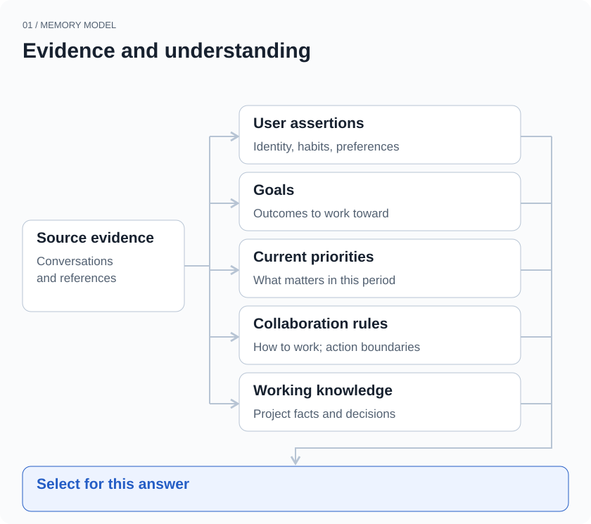
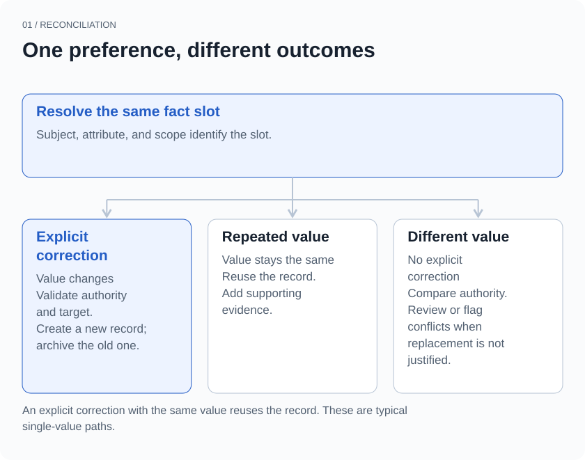
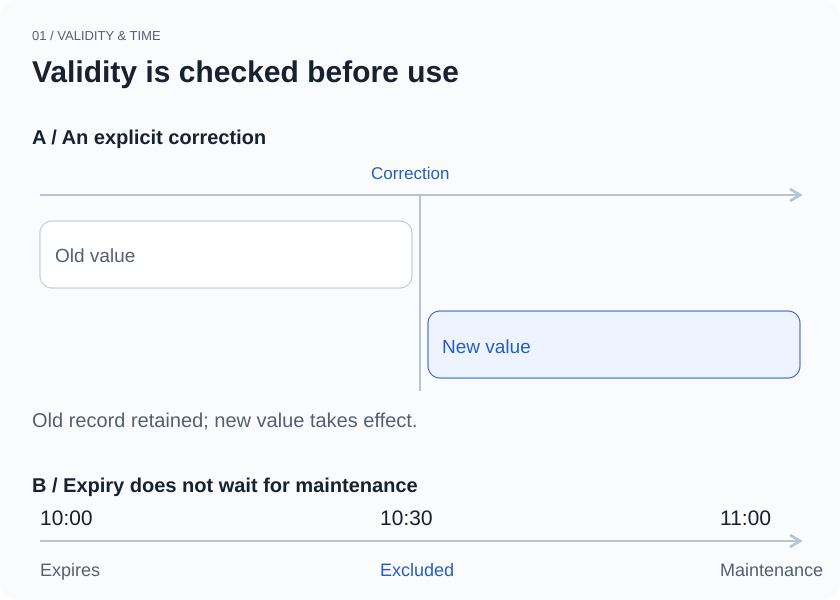

## Start with a correction

On Monday, you ask your assistant to plan the week: “Ship project A first.” By Wednesday, the client’s plans have changed. You say, “Put A on hold. Focus on B this week.” On Thursday morning, the assistant still puts A at the top of your schedule.

It remembered what you said. That memory is now getting in the way.

Adding long-term memory to a personal agent often starts with storing information so it can be retrieved later. With continued use, another set of questions becomes hard to avoid. Something used to be true; is it still true? Is the user adding information or correcting it? Should a temporary request affect the next ten minutes, or every conversation from now on?

This article examines part of xopc’s implementation for these cases. We will use a smaller example: you used to prefer short answers, but now explicitly ask to change that preference and show the reasoning in detail. Where should the old preference stop applying, and how should the new one take over?

> The conversations and times in this article are illustrative examples. The implementation notes refer to the code snapshot linked below. The tests check data and context rules; they do not establish that a model can identify user intent correctly in every conversation.

## Different kinds of things to remember

“I prefer short answers” and “Work on A first this week” are both short statements, but they need different maintenance rules. The first might remain useful for months. The second needs reconsideration next week. “Let me review it before you send it to the client” sets a boundary on actions. It should not be inferred from a few observations in the same way as an ordinary preference.

xopc separates this persistent information into five categories: assertions about the user, goals, priorities with a time window, collaboration rules, and working knowledge. An *assertion* is a statement about a person. It still needs to say who supplied it, when it applies, and where it applies.

| Information | Example | What it describes |
| --- | --- | --- |
| User preference | “I prefer the conclusion first.” | A personal habit |
| Long-term goal | “I want to launch this product.” | A desired outcome |
| Current priority | “Focus on launch issues this week.” | What matters most right now |
| Collaboration rule | “Let me review it before you send it.” | How to work together and when to ask |
| Working knowledge | “We chose API design B.” | Project facts and decisions |



*Figure 1 · Evidence and the information derived from it are stored separately. This is a conceptual diagram; each category has its own storage and selection rules.*

A project’s deadline is working knowledge. Wanting to ship the project is a goal. Putting it first this week is a priority. The project can remain worth doing without taking first place every week. Keeping these categories separate lets a temporary priority expire without erasing the longer-term goal.

Source evidence is stored separately, too. The system can trace a judgment back to a conversation without using that passage as the judgment’s entire identity. One judgment can have several pieces of supporting evidence. A single sentence can also contain information that needs to be handled separately.

This adds data structures and maintenance work. The benefit is specific: when something changes, we know whether we are changing a preference, a goal, or a time window that is about to end.

## Give a fact a stable identity

Consider the answer-length preference again. If “prefers short answers” and “prefers detailed answers” are stored as unrelated memories, retrieval may return both. The model then has to guess: which is newer? Do they apply to different situations? Should it try to follow both?

xopc first assigns this kind of fact a stable location, called a *slot* in the code. The slot is determined by the user it belongs to, the subject, the attribute, and the scope. The preference’s value is not part of that identity.

```text
One slot:
Subject     Current user
Attribute   preference.response.detail
Scope       global

Values in that slot:
Old record  concise
New record  detailed
```

The system can now ask a precise question: “Has this person’s preferred level of detail changed within the same scope?” Scope also prevents an unrelated change. Asking for detailed reasoning on one project should not silently change how the assistant answers on every other project. A project-scoped record must include a project identifier; validation rejects a missing identifier rather than quietly widening the scope to global.

Some attributes allow multiple values. Others allow only one current value. Speaking both Chinese and English is perfectly consistent. Opposite preferences for answer length, within the same scope and time period, require replacement or conflict handling. That distinction is part of the slot as well.

This mechanism depends on extraction getting the attribute right. If the model assigns two versions of the same preference to unrelated attributes, the reconciliation logic cannot simply discover that they describe the same thing. Stable identity gives a correction somewhere to land, while making extraction accuracy more important.

## How new information replaces old information

In xopc’s `reconcileAssertion`, explicit corrections are handled before ordinary duplicate detection. A correction must point to the original record, and this path is reserved for information the user has explicitly stated. The system checks that the original record belongs to the same resolved slot.

When the value changes, the new record links to the record it replaces. The old record’s validity period is closed, and its status becomes archived. These writes happen in one database transaction. If we later need to explain an earlier answer, the old preference and its replacement relationship are still available.



*Figure 2 · Typical reconciliation paths for a single-valued preference. Explicit corrections require authority and target checks. A correction that leaves the value unchanged reuses the existing record.*

If the corrected value has not changed, the system updates the wording, observation time, and supporting evidence on the existing record. Ordinary repeated statements also have a deduplication path. There is no need to accumulate a row of nearly identical preferences.

We do not treat “newer” as a synonym for “more authoritative.” Suppose you explicitly said you like short answers. After several follow-up questions, the system infers that you prefer detailed answers. That inference came later, but it cannot override your explicit statement. When the two conflict, the inference is marked as conflicting.

Even when both statements came from the user, automatic replacement is not always justified. Without an explicit correction relationship, different values for the same single-valued attribute and overlapping time period may send the new record to review. A correction linked to the original record provides a firmer basis for replacement. This conservative choice can leave more items awaiting confirmation, but it reduces the chance of treating additional context as a change of mind.

“Please explain this problem in detail” also does not necessarily change a lasting preference. The sequence described here starts after a correction has been identified and linked correctly. Extraction still has to distinguish “this time” from “from now on.”

## When a memory stops being usable

Users cannot be expected to return and edit every temporary memory. “Focus on the launch this week” needs reconsideration next week. “I’m traveling at the moment” should not follow someone forever.

Alongside observation and ingestion times, a record can have a start time, an end time, and a review time. Observation time answers “When did we learn this?” Validity answers “When does it apply?” Information entered today might describe a situation that ended last week.

Background maintenance handles expired, stale, and review-due records. But a record does not remain usable merely because maintenance has not run yet. During selection, `canUseAssertion` checks validity and review times against the current time. Expired records and records due for review fail that check.



*Figure 3 · The upper timeline shows validity before and after an explicit correction. The lower timeline shows the gap between expiry and background maintenance. The records and times are illustrative.*

This closes an easy-to-miss gap. If a memory expires at 10:00 and maintenance runs at 11:00, an answer at 10:30 should already exclude it. An existing test specifically checks expiry before maintenance has run.

Stopping use and deleting information serve different purposes. A record that should no longer affect an answer may remain available as history. When the user explicitly deletes information, xopc also handles correction chains and records suppression information to keep automatic extraction from readily rebuilding the deleted understanding. That mechanism governs the memory writes it manages. It does not imply that historical conversations, backups, or external sources have all been erased.

## Select again before answering

The memory store can keep growing. The context given to the model needs limits. A record’s presence in the database is not a reason to include it in every answer.

1. **Check scope:** Does it belong to the current project, conversation, or global context?
2. **Check eligibility:** Do its status, validity, and sensitivity permit use?
3. **Rank by value:** How relevant and important is it to the current question?
4. **Apply a budget:** Select within record-count and character limits.
5. **Present separately:** Distinguish explicit user statements from tentative inferences.

In the current implementation, user assertions pass scope and applicability checks, followed by use-eligibility checks. They are then ranked using factors such as question relevance, importance, consequence, and actionability, with a limit on the number selected. Working knowledge follows its own retrieval and ranking path. These results, goals, priorities, and collaboration rules are then assembled within a character budget.

Confidence and importance are deliberately separate. Being very sure that someone prefers a particular answer format does not make that preference more useful than information needed for the current task. Ranking directly by confidence can fill the context with stable but irrelevant details.

Another trade-off is allowing limited inference to inform personalization. xopc can include an eligible observation or inference as a *working assumption*: its confidence must be at least 0.7, its consequence low or medium, its sensitivity normal, and it must pass validity and other checks. Explicit user statements are selected first. The two categories are presented separately to the model.

The 0.7 value is an implementation policy threshold, not a statistically calibrated “70% chance of being correct.” Working assumptions may help adjust an answer, but the prompt explicitly says they cannot authorize actions, must not be presented as user-confirmed facts, and remain subordinate to current instructions.

These controls also have different strengths. Code can directly decide whether a record enters the context. Whether the model consistently treats a labeled assumption with enough caution still depends on the model. Restrictions on tool calls need corresponding execution checks; a reminder to “be careful” inside memory is not enough.

## What we test, and what can still go wrong

We use small tests to inspect record status, validity periods, replacement links, and eligibility for context. They do not need a demonstration answer that merely sounds convincing.

| Input or change | What the test checks |
| --- | --- |
| The same preference is repeated | Reuse the record without increasing the slot count |
| An existing preference is explicitly corrected | Link the new record to the old one and close the old validity period |
| An inference contradicts an explicit preference | Mark the inference as conflicting and retain the explicit preference |
| Two records have non-overlapping validity periods | Resolve by query time without treating historical change as a conflict |
| A record has expired before maintenance runs | Reject it at the use check |
| An automatically activated inference becomes riskier | Still enforce confidence, consequence, and sensitivity checks |
| Automatic extraction runs after deletion | Suppress automatic recreation while preserving an explicit restoration path |

These tests establish that the rules behave as intended. They do not establish that memory is a solved problem. Extracting the right attribute, distinguishing a current request from a lasting preference, and finding the correct correction target can still fail. Lexical relevance can miss information expressed in different words. Useful information can also lose out under a limited context budget.

We treat memory as a record that can be revised, traced to a source, and used under stated conditions. An assistant needs to remember you and allow you to change your mind. One practical check is this: after you say, “That earlier preference was wrong; use this one from now on,” does the old understanding actually stop influencing the next answer?

**See this information in xopc**

Explore the product’s user-understanding and memory capabilities, or inspect the implementation below. To check a correction, look both at the updated record and at what subsequent answers actually use.

[Explore xopc’s capabilities →](/en/product-map)

## Implementation and tests

Reviewed against the code snapshot on September 21, 2026. The links are pinned to the same revision so the implementation can be read alongside the article. Later releases may behave differently.

- [Fact slots, deduplication, corrections, and conflict reconciliation](https://github.com/xopcai/xopc/blob/a2a1fb40af4dc42fc35416ded195b573ab5b8977/src/user-model/repository.ts)
- [Working assumptions and use eligibility](https://github.com/xopcai/xopc/blob/a2a1fb40af4dc42fc35416ded195b573ab5b8977/src/user-model/usage-policy.ts)
- [Context selection, ranking, and budgets](https://github.com/xopcai/xopc/blob/a2a1fb40af4dc42fc35416ded195b573ab5b8977/src/agent/context/execution-context.ts)
- [Correction, conflict, history, and deletion tests](https://github.com/xopcai/xopc/blob/a2a1fb40af4dc42fc35416ded195b573ab5b8977/src/user-model/__tests__/user-model.test.ts)
- [Expiry and inference-risk tests](https://github.com/xopcai/xopc/blob/a2a1fb40af4dc42fc35416ded195b573ab5b8977/src/user-model/__tests__/usage-policy.test.ts)
- [Execution-context tests](https://github.com/xopcai/xopc/blob/a2a1fb40af4dc42fc35416ded195b573ab5b8977/src/agent/context/__tests__/execution-context.test.ts)

[Next: Why chat history isn’t the same as model context](/en/blog/history-is-not-context)
