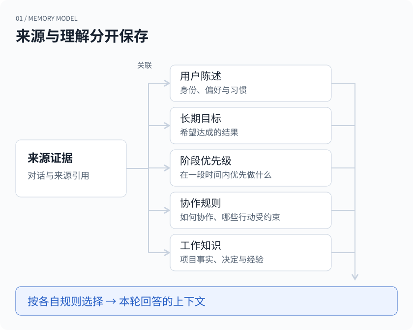
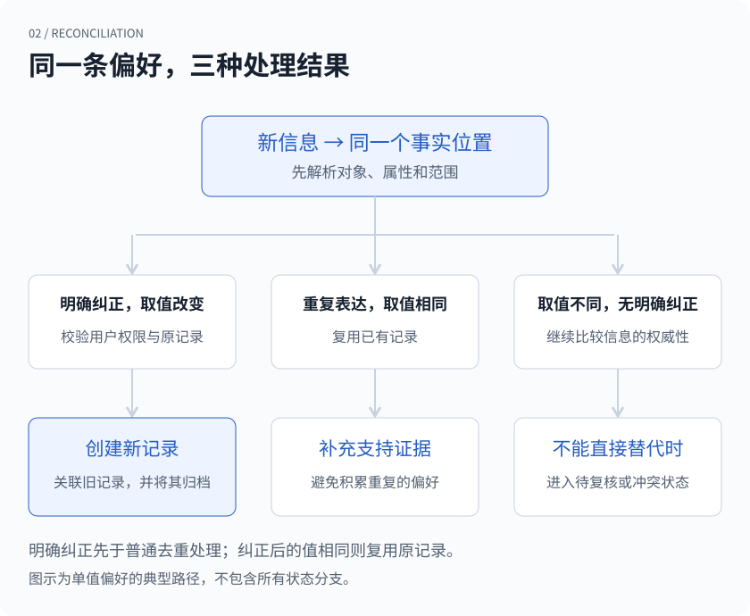
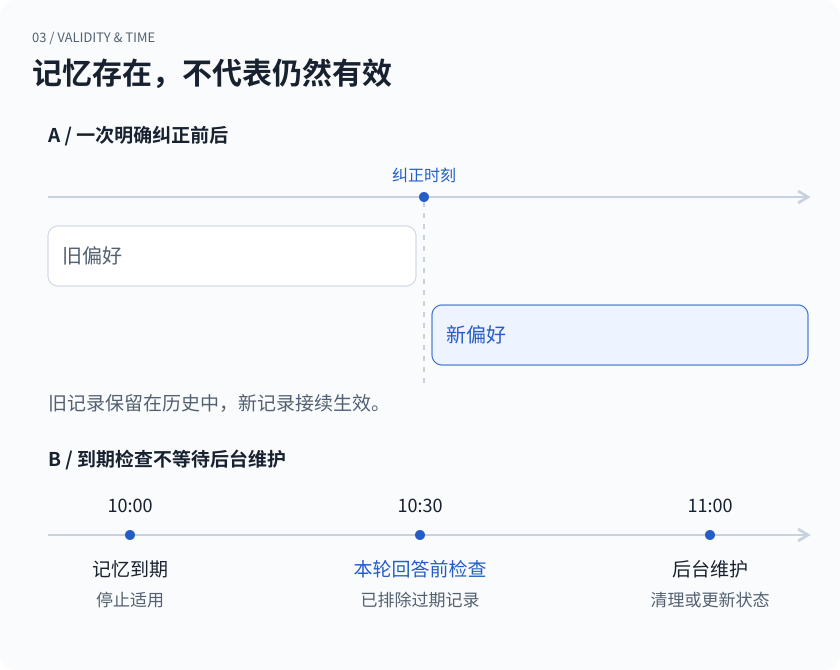

## 从一句纠正开始

周一，你让助理安排这周的工作：“先把项目 A 上线。”到了周三，客户那边有了变化，你又说：“A 先停一下，这周处理 B。”周四早上，助理依旧把 A 放在日程最前面。

它记住了你说过的话。但这份记忆已经妨碍它做事。

给个人 Agent 加上长期记忆，很容易从“存下来，以后搜得到”开始。用得久了，另一类问题会越来越常见：一件事曾经是真的，现在还算不算？用户这次是在补充信息，还是在改口？一句临时要求，应该影响接下来十分钟，还是以后每一次对话？

这篇文章拆开 xopc 处理这些问题的一部分实现。我们从一个更小的例子入手：你原先希望回答简短，后来明确要求修改这个偏好，以后把推导过程写清楚。一条旧偏好该在哪里停止生效，新的偏好又该怎样接上？

> 文中的对话与时间为说明机制而构造的示例。

## 先分清记住的是什么

“我喜欢简短回答”和“这周先做 A”都可以写成一句话，但维护方式相差很大。前者可能持续几个月，后者到了下周就需要重新判断。“发给客户前让我确认”则涉及行动边界，不能和普通偏好一样，靠几次观察就推测出来。

xopc 把这些持久信息分为五类：关于用户的陈述、目标、带时间范围的优先级、协作规则，以及工作知识。代码里的用户陈述叫 assertion，可以理解为一条“关于这个人的说法”。它仍然需要说明谁说的、何时有效、适用于哪里。

| 信息 | 例子 | 描述什么 |
| --- | --- | --- |
| 用户偏好 | “我习惯先看结论。” | 这个人的习惯 |
| 长期目标 | “我想把产品发布出去。” | 想达成的结果 |
| 阶段优先级 | “本周先处理上线问题。” | 此刻的轻重缓急 |
| 协作规则 | “发给客户前让我确认。” | 协作方式与边界 |
| 工作知识 | “接口方案采用版本 B。” | 项目事实与决定 |



*图 1 · 来源与理解分开保存。图中展示概念关系，各类信息仍有自己的存储和选择逻辑。*

这里有个容易混淆的地方：项目截止日期属于工作知识，想把项目发布出去属于目标，本周把它排在第一位属于优先级。项目仍然值得做，并不意味着它每周都该排在第一位。分开存储后，临时安排到期，不需要顺带抹掉长期目标。

来源证据也单独保存。系统可以知道“这条判断来自哪次对话”，而不用把一段原文当成它的全部身份。同一个判断可以有多份支持证据；原文里的一句话，也可能包含需要分别处理的信息。

这会增加数据结构和维护逻辑。换来的好处很具体：当某条信息变了，我们知道要改的是偏好、目标，还是一个即将结束的时间窗口。

## 给事实一个稳定的位置

回到回答长短的例子。如果直接把“喜欢简短回答”和“喜欢详细回答”当成两条互不相关的记忆，检索可能把两条都找回来。接下来只好让模型猜：哪条更新？是不是不同场景？该不该同时遵守？

xopc 先给这类事实确定一个稳定的位置，代码里称为 slot。它由用户归属、描述对象、属性和作用范围共同确定。偏好的具体取值不参与这个位置的身份。

```text
同一个位置：
对象    当前用户
属性    preference.response.detail
范围    global

这个位置上的取值：
旧记录  concise
新记录  detailed
```

这个结构让系统能够问一个明确的问题：“同一个范围内，这个人对回答详细程度的偏好发生了变化吗？”它也避免另一种误伤：你在某个项目里要求详细论证，不应该顺手改掉其他项目的回答方式。项目范围必须带项目标识，缺失时会被校验拒绝，不能悄悄扩大成全局。

有些属性允许多个取值，有些只能有一个当前值。会说中文和英文可以同时成立；同一范围、同一时段的回答详细程度若出现相反取值，就需要处理替代或冲突。这个区别也写在 slot 上。

这套机制依赖前面的信息提取：同一种偏好得被归到同一个属性。如果模型把它们识别成两个无关属性，后面的协调逻辑无法凭空发现它们说的是一件事。稳定身份让纠正有了落点，也让提取是否准确变得更重要。

## 新信息怎样替代旧信息

在 xopc 的 `reconcileAssertion` 中，明确纠正会在重复检测之前处理。一个纠正请求需要指向原记录，而且只有用户明确表达的信息能够走这条路径。系统会检查原记录是否属于刚才解析出的同一个 slot。

当取值确实改变时，新记录会关联被替代的记录，旧记录的有效期被关闭，并进入归档状态。这些写入放在同一个数据库事务里。以后追查“为什么助理曾经这样回答”时，旧偏好和替代关系仍然有据可查。



*图 2 · 单值偏好的几条典型协调路径。明确纠正需要通过权限和目标校验；相同取值的纠正会复用已有记录。*

如果纠正后的取值并没有变，系统会更新表述、观察时间和支持证据，复用已有记录。普通的重复表达也有去重路径，不需要积累一排几乎一样的记忆。

我们没有把“更新的一条”直接等同于“更可信的一条”。假设你明确说过喜欢简短回答，系统却因为你连续追问了几次，推测你喜欢详细回答。这条推测出现得更晚，但它不能覆盖你的明确表达；发生冲突时，推测会被标记为冲突。

即使新旧信息都来自用户，也不意味着新内容总能自动替代旧内容。如果没有明确的纠正关系，同一时段、同一单值属性出现不同值，新记录可能进入待复核状态。对于已明确关联到原记录的纠正，系统才有足够依据完成替换。这种保守处理有时会多留下一条待确认信息，却能减少误把补充当改口的情况。

需要强调的是，“请详细说说这一题”未必表示长期偏好改变。文章里的时间线从纠正已经被识别、正确关联之后开始。自然语言里的“这次”和“以后”，仍然需要提取环节判断。

## 过期的记忆在哪里停下来

用户也不可能每次都专门回来修改记忆。“本周集中处理上线”到了下周，系统应该重新判断；“最近在出差”更不能一直跟着用户。

因此，记录除了观察时间和入库时间，还可以有生效时间、失效时间和复核时间。观察时间回答“什么时候知道的”，有效期回答“什么时候适用”。一条今天才录入的信息，也可能描述上周已经结束的状态。

后台维护任务会处理到期、陈旧和需要复核的记录，但停止使用不依赖这次后台任务有没有及时执行。每次选择用户信息时，`canUseAssertion` 都会用当前时间检查有效期与复核时间。已经过期，或者到了该复核的时候，就不再通过这道检查。



*图 3 · 上半图表示一次明确纠正前后的有效期；下半图表示到期检查与后台维护之间的时间差。时间与记录均为示意。*

这解决了一个容易漏掉的时间差：假设一条记忆十点过期，后台十一点才清理，十点半的回答也不该继续使用它。

停止使用与删除承担不同的工作。信息不再适合影响当前回答时，可以保留历史供追溯。用户明确删除时，xopc 还会处理纠正链，并记录抑制信息，阻止自动提取路径轻易把刚删掉的理解重新建回来。这个机制约束的是受它管理的记忆写入；它不意味着历史对话、备份或外部来源都被一并清除。

## 回答前，还要再选一次

记忆库可以持续增长，交给模型的上下文需要克制。一条记录存在数据库中，不等于每次回答都应该用它。

1. **检查范围**：属于当前项目、会话或全局吗？
2. **检查资格**：状态、有效期与敏感性允许使用吗？
3. **按价值排序**：与当前问题有多相关，现在有多重要？
4. **控制预算**：在条数与字符限制内选入内容。
5. **分别呈现**：用户明确表达与系统暂时推测分开交给模型。

在当前实现里，用户陈述先经过范围和适用条件检查，再检查是否允许使用。之后才根据问题相关性、重要程度、后果、可行动性等因素排序，并限制条数。工作知识走自己的检索和排序路径，最后连同目标、优先级及协作规则一起，在字符预算内组织成上下文。

这里刻意把“有多确信”和“有多重要”分开。系统很确信你偏爱某种回答格式，不代表这条偏好应该挤掉当前任务中的重要信息。把置信度直接当成排序权重，容易让稳定但无关的细节占满上下文。

另一个取舍是允许有限的推测参与个性化。xopc 当前允许符合条件的观察或推断作为 working assumption，也就是暂时假设：置信度至少为 0.7，后果为低或中等、敏感性为普通，并通过有效期等检查。用户明确表达的信息优先选入，两类内容在交给模型时分开呈现。

这个 0.7 是实现中的策略阈值，不是经过统计校准的“七成正确率”。临时假设可以帮助调整回答方式，但提示中明确要求：不能据此授权行动，不能把推测表述成用户确认过的事实，当前指令优先。

这些措施也有不同的强度。是否允许某条记忆进入上下文，可以由代码直接控制；模型看到“这是暂时假设”以后是否始终谨慎表达，还取决于模型。涉及工具调用的限制，需要相应的执行检查，不能只靠在记忆里写一句“请谨慎”。

## 哪里仍会出错

从一句自然语言里提取对的属性、区分当前请求和长期偏好、找到准确的纠正目标，仍然可能出错。词法相关性也会漏掉表达不同但意思相近的内容；有限预算下，有用的信息可能没有被选中。

这也是为什么我们更愿意把记忆看成一份可以修订、有来源、有使用条件的记录。助理需要记住你，也需要允许你改变主意。对我们来说，一个很实际的检查标准是：当你说“之前那个不对，以后改成这样”，旧理解是否真的退出了下一次回答。

[探索 xopc 的能力 →](/zh/product-map)

[下一篇：聊天记录还在，为什么不能原样交给模型？](/zh/blog/history-is-not-context)
